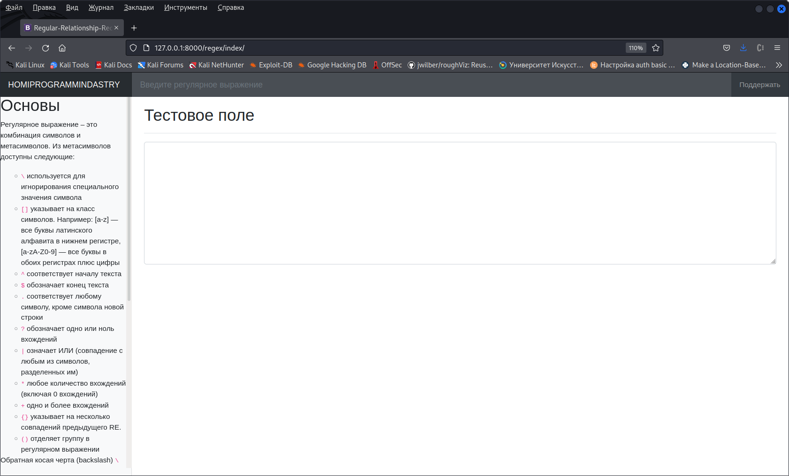
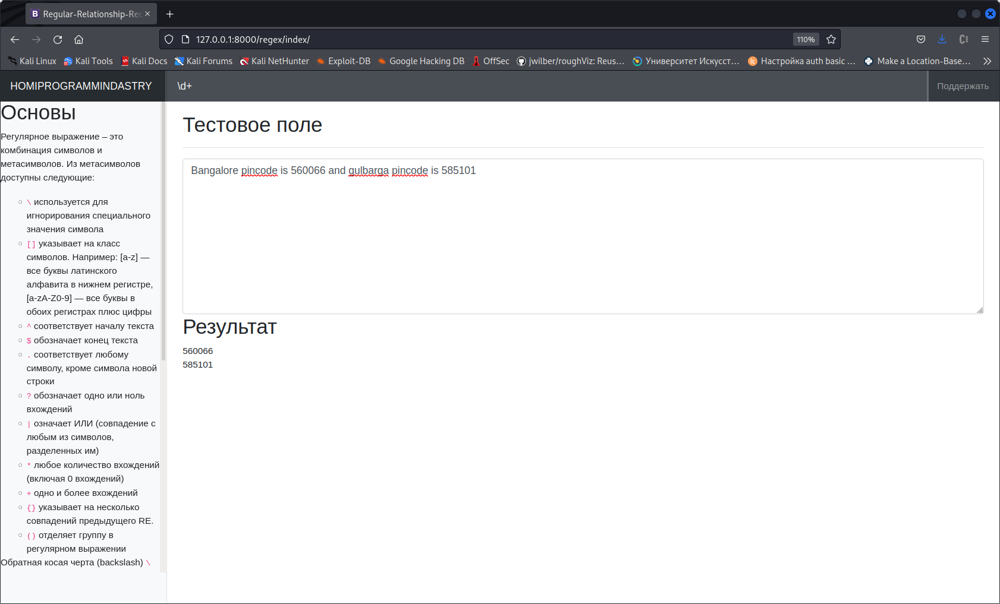

# Regular-Relationship-Recognition
Данный ресурс является инструментом для работы с регулярными выражениями.
В приложении предоставлено два поля ввода: 
для исходной строки и самого регулярного выражения.
а выходе мы получаем результат работы выражения.
# Установка
Для установки трбуется python3.10 или выше, а также выполнить команду pip3 install requirements.txt
# Демонстрация
Главная страница

Пример работы

